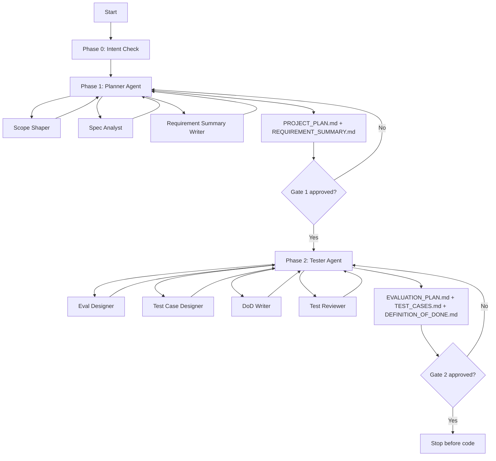

# Planner Tester V1 Diagram

```mermaid
flowchart TD
    S["Start"] --> P0["Phase 0: Intent Check"]
    P0 --> P1["Phase 1: Planner Agent"]
    P1 --> SS["Scope Shaper"]
    P1 --> SA["Spec Analyst"]
    P1 --> RS["Requirement Summary Writer"]
    SS --> P1
    SA --> P1
    RS --> P1
    P1 --> A1["PROJECT_PLAN.md + REQUIREMENT_SUMMARY.md"]
    A1 --> G1{"Gate 1 approved?"}
    G1 -- "No" --> P1
    G1 -- "Yes" --> T1["Phase 2: Tester Agent"]
    T1 --> ED["Eval Designer"]
    T1 --> TC["Test Case Designer"]
    T1 --> DD["DoD Writer"]
    T1 --> TR["Test Reviewer"]
    ED --> T1
    TC --> T1
    DD --> T1
    TR --> T1
    T1 --> A2["EVALUATION_PLAN.md + TEST_CASES.md + DEFINITION_OF_DONE.md"]
    A2 --> G2{"Gate 2 approved?"}
    G2 -- "No" --> T1
    G2 -- "Yes" --> STOP["Stop before code"]
```

