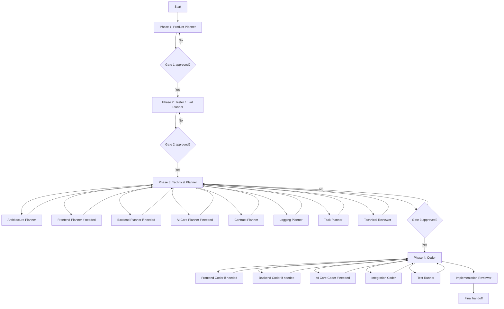

# Project Workflow V2 Diagram

```mermaid
flowchart TD
    S["Start"] --> P1["Phase 1: Product Planner"]
    P1 --> G1{"Gate 1 approved?"}
    G1 -- "No" --> P1
    G1 -- "Yes" --> P2["Phase 2: Tester / Eval Planner"]
    P2 --> G2{"Gate 2 approved?"}
    G2 -- "No" --> P2
    G2 -- "Yes" --> P3["Phase 3: Technical Planner"]
    P3 --> AP["Architecture Planner"]
    P3 --> FP["Frontend Planner if needed"]
    P3 --> BP["Backend Planner if needed"]
    P3 --> AIP["AI Core Planner if needed"]
    P3 --> CP["Contract Planner"]
    P3 --> LP["Logging Planner"]
    P3 --> TP["Task Planner"]
    AP --> P3
    FP --> P3
    BP --> P3
    AIP --> P3
    CP --> P3
    LP --> P3
    TP --> P3
    P3 --> TR["Technical Reviewer"]
    TR --> P3
    P3 --> G3{"Gate 3 approved?"}
    G3 -- "No" --> P3
    G3 -- "Yes" --> P4["Phase 4: Coder"]
    P4 --> FC["Frontend Coder if needed"]
    P4 --> BC["Backend Coder if needed"]
    P4 --> AIC["AI Core Coder if needed"]
    P4 --> IC["Integration Coder"]
    P4 --> TEST["Test Runner"]
    P4 --> IR["Implementation Reviewer"]
    FC --> P4
    BC --> P4
    AIC --> P4
    IC --> P4
    TEST --> P4
    IR --> DONE["Final handoff"]
```

