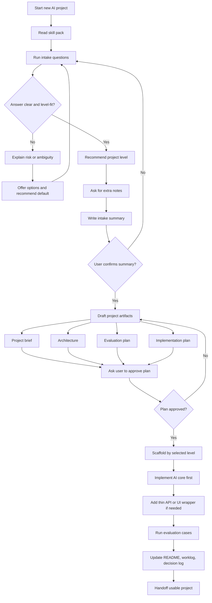
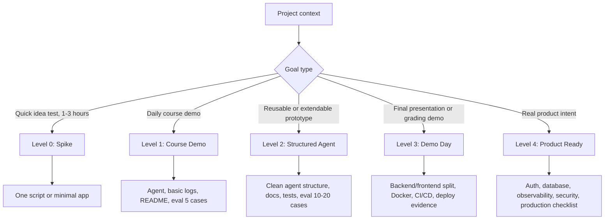
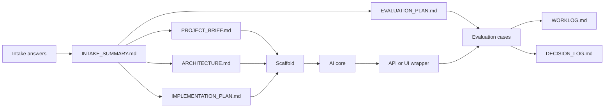

# VinUni AI Project Workflow Diagram

Open this file in Visual Studio Code and use **Markdown: Open Preview**.
VS Code can render Mermaid diagrams in Markdown preview. If your VS Code does not render it, install the extension **Markdown Preview Mermaid Support**.

## Main Workflow

## Level Selection

## Artifact Flow

