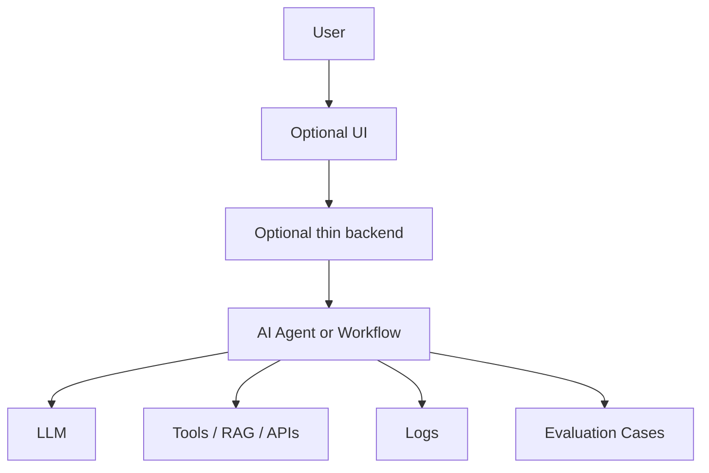

# Architecture

## Scope Shape

TODO

## System Overview

## AI Core

TODO

## Agent Type

TODO: single-agent / multi-step agent / multi-agent

## State

| Field | Purpose |
|-------|---------|
| TODO | TODO |

## Nodes Or Agents

| Name | Responsibility |
|------|----------------|
| TODO | TODO |

## Tools

| Tool | Purpose | Source |
|------|---------|--------|
| TODO | TODO | TODO |

## Contracts

TODO: API, module, event, or agent input/output contracts if needed.

## Backend

TODO: API endpoints if needed.

## Frontend

TODO: Streamlit / Next.js / none.

## Logging

TODO: What gets logged?

## Evaluation Hooks

TODO: How eval cases connect to the system.

## Risks

- TODO