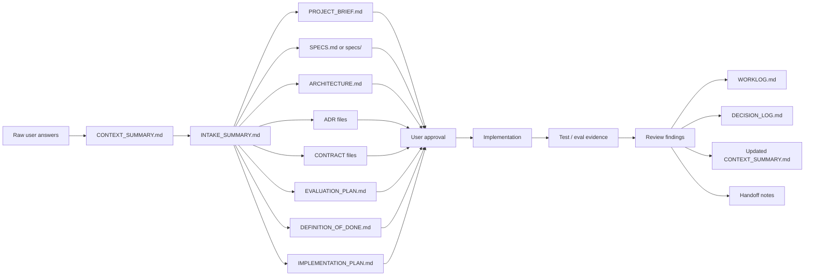

# Artifact Flow

```mermaid
flowchart LR
    A[Raw user answers] --> B[CONTEXT_SUMMARY.md]
    B --> C[INTAKE_SUMMARY.md]

    C --> D[PROJECT_BRIEF.md]
    C --> E[SPECS.md or specs/]
    C --> F[ARCHITECTURE.md]
    C --> G[ADR files]
    C --> H[CONTRACT files]
    C --> I[EVALUATION_PLAN.md]
    C --> J[DEFINITION_OF_DONE.md]
    C --> K[IMPLEMENTATION_PLAN.md]

    D --> L[User approval]
    E --> L
    F --> L
    G --> L
    H --> L
    I --> L
    J --> L
    K --> L

    L --> M[Implementation]
    M --> N[Test / eval evidence]
    N --> O[Review findings]
    O --> P[WORKLOG.md]
    O --> Q[DECISION_LOG.md]
    O --> R[Updated CONTEXT_SUMMARY.md]
    O --> S[Handoff notes]
```
