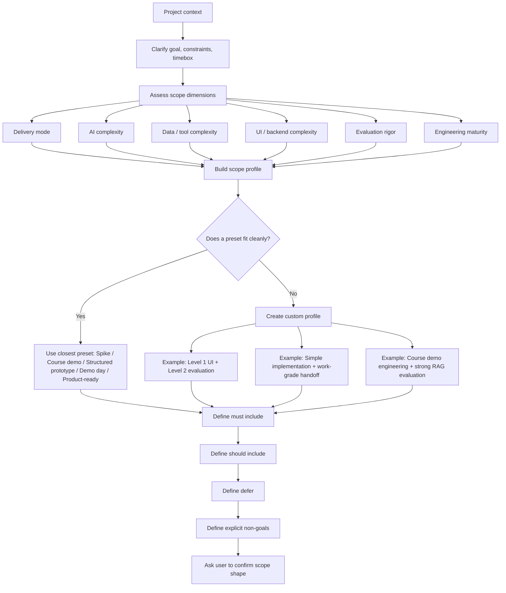

# Scope Shaping

```mermaid
flowchart TD
    A[Project context] --> B[Clarify goal, constraints, timebox]
    B --> C[Assess scope dimensions]

    C --> D[Delivery mode]
    C --> E[AI complexity]
    C --> F[Data / tool complexity]
    C --> G[UI / backend complexity]
    C --> H[Evaluation rigor]
    C --> I[Engineering maturity]

    D --> J[Build scope profile]
    E --> J
    F --> J
    G --> J
    H --> J
    I --> J

    J --> K{Does a preset fit cleanly?}

    K -- Yes --> L[Use closest preset: Spike / Course demo / Structured prototype / Demo day / Product-ready]
    K -- No --> M[Create custom profile]

    M --> N[Example: Level 1 UI + Level 2 evaluation]
    M --> O[Example: Simple implementation + work-grade handoff]
    M --> P[Example: Course demo engineering + strong RAG evaluation]

    L --> Q[Define must include]
    N --> Q
    O --> Q
    P --> Q

    Q --> R[Define should include]
    R --> S[Define defer]
    S --> T[Define explicit non-goals]
    T --> U[Ask user to confirm scope shape]
```
