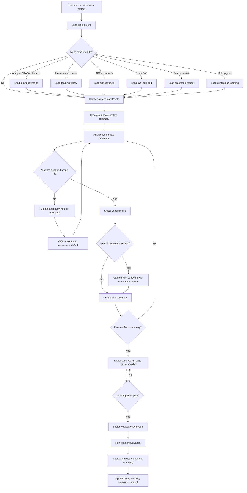

# Main Workflow

```mermaid
flowchart TD
    A[User starts or resumes a project] --> B[Load project-core]
    B --> C{Need extra module?}

    C -- AI agent / RAG / LLM app --> D[Load ai-project-intake]
    C -- Team / work process --> E[Load team-workflow]
    C -- ADR / contracts --> F[Load adr-contracts]
    C -- Eval / DoD --> G[Load eval-and-dod]
    C -- Enterprise risk --> H[Load enterprise-project]
    C -- Skill upgrade --> I[Load continuous-learning]
    C -- No --> J[Clarify goal and constraints]

    D --> J
    E --> J
    F --> J
    G --> J
    H --> J
    I --> J

    J --> K[Create or update context summary]
    K --> L[Ask focused intake questions]
    L --> M{Answers clear and scope-fit?}

    M -- No --> N[Explain ambiguity, risk, or mismatch]
    N --> O[Offer options and recommend default]
    O --> L

    M -- Yes --> P[Shape scope profile]
    P --> Q{Need independent review?}
    Q -- Yes --> R[Call relevant subagent with summary + payload]
    Q -- No --> S[Draft intake summary]
    R --> S

    S --> T{User confirms summary?}
    T -- No --> L
    T -- Yes --> U[Draft specs, ADRs, eval, plan as needed]

    U --> V{User approves plan?}
    V -- No --> U
    V -- Yes --> W[Implement approved scope]

    W --> X[Run tests or evaluation]
    X --> Y[Review and update context summary]
    Y --> Z[Update docs, worklog, decisions, handoff]
```
