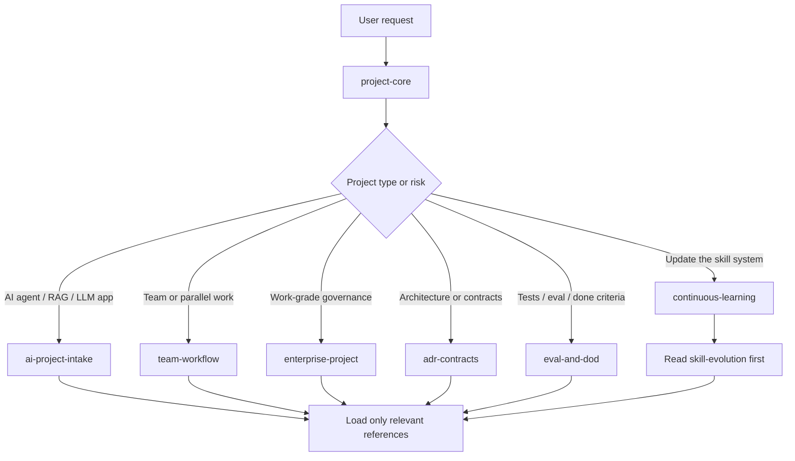

# Modular Skill Loading

```mermaid
flowchart TD
    A[User request] --> B[project-core]
    B --> C{Project type or risk}

    C -- AI agent / RAG / LLM app --> D[ai-project-intake]
    C -- Team or parallel work --> E[team-workflow]
    C -- Work-grade governance --> F[enterprise-project]
    C -- Architecture or contracts --> G[adr-contracts]
    C -- Tests / eval / done criteria --> H[eval-and-dod]
    C -- Update the skill system --> I[continuous-learning]

    D --> J[Load only relevant references]
    E --> J
    F --> J
    G --> J
    H --> J
    I --> K[Read skill-evolution first]
    K --> J
```
