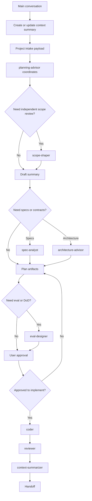

# Subagent Checkpoints

```mermaid
flowchart TD
    A[Main conversation] --> B[Create or update context summary]
    B --> C[Project intake payload]
    C --> D[planning-advisor coordinates]

    D --> E{Need independent scope review?}
    E -- Yes --> F[scope-shaper]
    E -- No --> G[Draft summary]
    F --> G

    G --> H{Need specs or contracts?}
    H -- Specs --> I[spec-analyst]
    H -- Architecture --> J[architecture-advisor]
    H -- No --> K[Plan artifacts]
    I --> K
    J --> K

    K --> L{Need eval or DoD?}
    L -- Yes --> M[eval-designer]
    L -- No --> N[User approval]
    M --> N

    N --> O{Approved to implement?}
    O -- No --> K
    O -- Yes --> P[coder]
    P --> Q[reviewer]
    Q --> R[context-summarizer]
    R --> S[Handoff]
```
